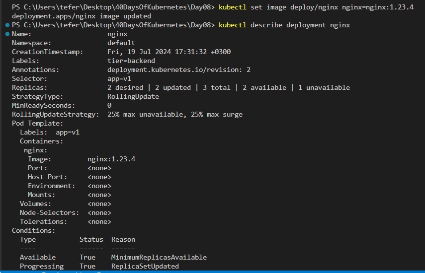

# 40DaysOfKubernetes

## Day 08

# Deployment and Replicaset

## Replica

In Kubernetes, a replica refers to an instance of a pod. Pods are the smallest deployable units that can be created and managed in Kubernetes. Each pod runs one or more containers, which are usually Docker containers.

Key Points About Replicas:
Ensuring Availability: Replicas are used to ensure that your application is available and resilient to failures. By running multiple replicas of a pod, you can handle more traffic and ensure that your application remains available even if some pods fail.

Load Balancing: When you have multiple replicas of a pod, Kubernetes can distribute the incoming traffic among them, providing load balancing.

Scaling: Replicas allow you to scale your application. By increasing the number of replicas, you can handle more load. Conversely, by decreasing the number of replicas, you can reduce resource consumption.

## Replication Controllers

Ensures that a specified number of pod replicas are running at any given time. If there are fewer replicas than desired, it creates new pods. If there are more, it deletes the excess pods.

## Replicaset

ReplicaSet is a newer object that supersedes ReplicationController.
ReplicaSet is a resource that ensures a specified number of pod replicas are running at any given time. It maintains a stable set of replica pods by scaling up or down as needed to match the desired state.

Here are some key features and uses of a ReplicaSet:

Replication: Ensures that a defined number of pod replicas are running.
Self-healing: Automatically replaces failed or deleted pods to maintain the desired number of replicas.
Scaling: Can be manually scaled up or down by changing the replica count.

## ReplicationController Demonstration

<pre>
apiVersion: v1
kind: ReplicationController
metadata:
  name: nginx-rc
  labels:
    env: demo
spec:
  template:
    metadata:
      labels:
        env: demo
      name: nginx-pod
    spec:
      containers:
        - image: nginx
          name: nginx
  replicas: 3
</pre>

### Explanation

apiVersion: v1: Specifies the API version of Kubernetes that the ReplicationController uses. v1 indicates it's a stable version.

kind: ReplicationController: Defines the type of Kubernetes object being created, which is a ReplicationController.

metadata:

name: nginx-rc: Sets the name of the ReplicationController to nginx-rc.
labels: A set of key-value pairs for labeling the ReplicationController.
env: demo: Labels the ReplicationController with env=demo.
spec: Specifies the desired state of the ReplicationController.

template: Describes the pod template used by the ReplicationController to create pods.
metadata:
labels: Sets labels for the pods created by this ReplicationController.
env: demo: Labels the pods with env=demo.
name: nginx-pod: (Note: The name field under pod metadata is not typically used and should be omitted.)
spec: Defines the pod specification.
containers: Lists the containers to be run in each pod.

- image: nginx: Specifies the container image to use. In this case, it's the nginx image from Docker Hub.
  name: nginx: Names the container nginx.
  replicas: 3: Specifies the number of pod replicas that the ReplicationController should maintain. In this case, it ensures there are always 3 replicas of the nginx pod running.

Create the Replication Controller by running the following command

`kubectl apply -f ReplicationController.yaml`

confirm the pods:

`kubectl get pods`

see the details by using the following command

`kubectl describe pods nginx-rc`

## ReplicaSet Demonestration

<pre>
apiVersion: apps/v1
kind: ReplicaSet
metadata:
  name: nginx-rs
  labels:
    env: demo
spec:
  template:
    metadata:
      labels:
        env: demo
      name: nginx-rc
    spec:
      containers:
        - image: nginx
          name: nginx
  replicas: 3
  selector:
    matchLabels:
      env: demo
</pre>

Explanation
apiVersion: apps/v1: Specifies the API version of Kubernetes that the ReplicaSet uses. apps/v1 indicates it's a stable version for applications.

kind: ReplicaSet: Defines the type of Kubernetes object being created, which is a ReplicaSet.

metadata:

name: nginx-rs: Sets the name of the ReplicaSet to nginx-rs.
labels: A set of key-value pairs for labeling the ReplicaSet.
env: demo: Labels the ReplicaSet with env=demo.
spec: Specifies the desired state of the ReplicaSet.

template: Describes the pod template used by the ReplicaSet to create pods.
metadata:
labels: Sets labels for the pods created by this ReplicaSet.
env: demo: Labels the pods with env=demo.
name: nginx-rc: This field is not typically used and can be omitted.
spec: Defines the pod specification.
containers: Lists the containers to be run in each pod.

- image: nginx: Specifies the container image to use. In this case, it's the nginx image from Docker Hub.
  name: nginx: Names the container nginx.
  replicas: 3: Specifies the number of pod replicas that the ReplicaSet should maintain. In this case, it ensures there are always 3 replicas of the nginx pod running.

selector:

matchLabels: Specifies how the ReplicaSet identifies the pods it should manage.
env: demo: This selector matches pods with the label env=demo. This ensures that only pods with this label are managed by this ReplicaSet.

apply the configuration by using the following command:
`kubectl apply -f Replicaset.yaml`

confrim the creation:
`kubectl get pods`

# Deployment

A Deployment in Kubernetes is a higher-level resource object that manages stateless applications. It provides a declarative way to manage the lifecycle of applications, offering advanced features for deployment, scaling, and management of application pods.

Key Features of Deployments
Declarative Updates: Allows you to describe the desired state of your application in a Deployment object, and Kubernetes ensures the current state matches the desired state.
Rolling Updates: Supports automated rolling updates to ensure zero downtime during updates. Kubernetes progressively replaces old pods with new ones.
Rollback: Maintains a history of deployments, allowing you to rollback to previous versions if something goes wrong.
Scaling: Easily scale the number of replicas up or down.
Self-Healing: Automatically replaces failed or unhealthy pods to maintain the desired number of replicas.
Multi-versioned Deployments: Manage multiple versions of an application simultaneously.
A Deployment in Kubernetes is a higher-level resource object that manages stateless applications. It provides a declarative way to manage the lifecycle of applications, offering advanced features for deployment, scaling, and management of application pods.

### Key Features of Deployments

Declarative Updates: Allows you to describe the desired state of your application in a Deployment object, and Kubernetes ensures the current state matches the desired state.
Rolling Updates: Supports automated rolling updates to ensure zero downtime during updates. Kubernetes progressively replaces old pods with new ones.
Rollback: Maintains a history of deployments, allowing you to rollback to previous versions if something goes wrong.
Scaling: Easily scale the number of replicas up or down.
Self-Healing: Automatically replaces failed or unhealthy pods to maintain the desired number of replicas.
Multi-versioned Deployments: Manage multiple versions of an application simultaneously.

### Why Use Deployments Instead of ReplicaSet and ReplicationController?

Higher-Level Abstraction: Deployments provide a higher-level abstraction for managing applications compared to ReplicaSets and ReplicationControllers.
Ease of Use: With Deployments, you can manage the entire lifecycle of an application in a single resource object, simplifying operations.
Rolling Updates and Rollbacks: Deployments offer built-in support for rolling updates and rollbacks, which are essential for maintaining application availability during updates.
History and Versioning: Deployments maintain a history of changes, allowing you to track and rollback to previous versions easily.
Integration with Other Kubernetes Features: Deployments integrate well with other Kubernetes features like Horizontal Pod Autoscalers, enabling advanced scaling policies based on resource utilization.
Automated Management: Deployments automate the management of ReplicaSets, including scaling and updates, reducing the need for manual intervention.

## Deployment Demonstration

<pre>
apiVersion: apps/v1
kind: Deployment
metadata:
  name: nginx-deploy
  labels:
    env: demo
spec:
  template:
    metadata:
      labels:
        env: demo
      name: nginx-rc
    spec:
      containers:
        - image: nginx
          name: nginx
  replicas: 2
  selector:
    matchLabels:
      env: demo

</pre>

Explanation
apiVersion: apps/v1: Specifies that this Deployment uses the apps/v1 API version, which is the stable API version for managing deployments in Kubernetes.

kind: Deployment: Indicates that this resource is a Deployment, which is a higher-level Kubernetes object used to manage stateless applications.

metadata:

name: nginx-deploy: Sets the name of the Deployment to nginx-deploy.
labels: Adds metadata labels to the Deployment for identification and organization.
env: demo: Labels the Deployment with env=demo.
spec: Defines the desired state of the Deployment.

replicas: 2: Specifies that 2 replicas of the defined pod should be running at all times.
selector:
matchLabels: Defines how the Deployment identifies the pods it manages.
env: demo: The Deployment will manage pods with the label env=demo.
template: Describes the pod template used by the Deployment to create pods.
metadata:
labels: Sets labels for the pods created by this Deployment.
env: demo: Labels the pods with env=demo.
name: nginx-rc: Although it's included here, the name field under pod metadata is not typically used and can be omitted.
spec: Defines the specification for the pod.
containers: Lists the containers to be run in each pod.

- image: nginx: Specifies the container image to use. In this case, it's the nginx image from Docker Hub.
  name: nginx: Names the container nginx.

apply the configuration by using the following command:
`kubectl apply -f Deployment.yaml`

confirm the pods deployment:
`kubectl get pods`

if you want the deployment run:

`kubectl get deploy`

If you want to see all the objects that are running on your cluster:
`kubectl get all`

as you can see the Dployment created the ReplicaSet which then created the Pods.

If you want to update the something of the pod Imperatively:
`kubectl set image deploy/nginx-deploy nginx=nginx:1.8.9`

to see the detail of the pod and see the upgrade:

`kubectl describe pod nginx-deploy`

If you want to undo the upgrade run the following command:

`kubectl rollout undo deploy/nginx-deploy`

# Task8

`manifest .task8-1.yaml`

# updated image to 1.23.4

# undo rollout

# Scale the Deployment to 5 replicas

`kubectl scale deploy/nginx --replicas=5`

# undo rollout

`kubectl rollout undo deploy/nginx`

# Task-8/b

#Task-8/c

