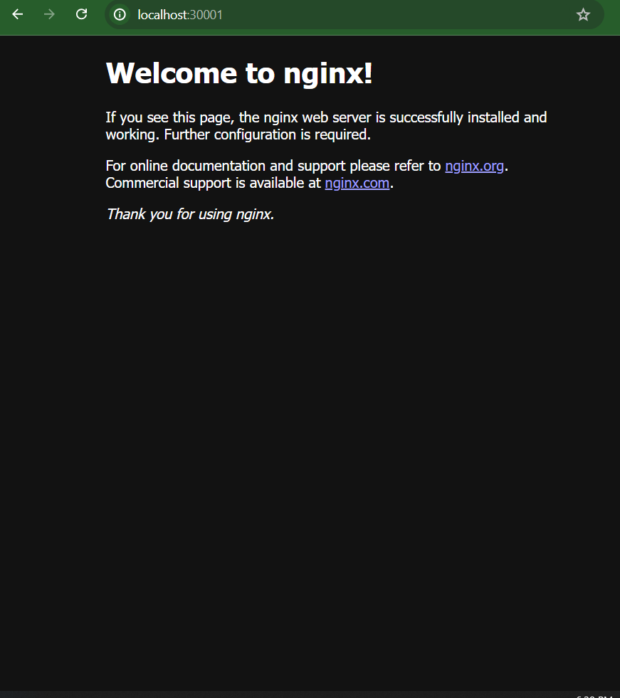

# 40DaysOfKubernetes Day09

## Services in Kubernetes

The idea of a Service is to group a set of Pod endpoints into a single resource. You can configure various ways to access the grouping. By default, you get a stable cluster IP address that clients inside the cluster can use to contact Pods in the Service. A client sends a request to the stable IP address, and the request is routed to one of the Pods in the Service.

A Service identifies its member Pods with a selector. For a Pod to be a member of the Service, the Pod must have all of the labels specified in the selector.

It make the pods to be lossely coupled, ensures they are running on specific port and it
provides a communication between the pods

## Why use a Kubernetes Service?

In a Kubernetes cluster, each Pod has an internal IP address. But the Pods in a Deployment come and go, and their IP addresses change. So it doesn't make sense to use Pod IP addresses directly. With a Service, you get a stable IP address that lasts for the life of the Service, even as the IP addresses of the member Pods change.

A Service also provides load balancing. Clients call a single, stable IP address, and their requests are balanced across the Pods that are members of the Service.

## Types of Kubernetes Services

ClusterIP (default): Internal clients send requests to a stable internal IP address.

NodePort: Clients send requests to the IP address of a node on one or more nodePort values that are specified by the Service.

LoadBalancer: Clients send requests to the IP address of a network load balancer.

ExternalName: Internal clients use the DNS name of a Service as an alias for an external DNS name.

# NodePort

In Kubernetes, a NodePort is a type of Service that exposes the Service on each Node's IP address at a static port (the NodePort). This makes the Service accessible from outside the Kubernetes cluster. Here are the key points about NodePort Services:

Static Port on Nodes: When you create a NodePort Service, Kubernetes allocates a port from a range (default is 30000-32767) and exposes it on each Node in the cluster. This port is the same across all Nodes.

Accessibility: The Service can be accessed from outside the cluster using the <NodeIP>:<NodePort> combination. This allows external clients to communicate with the Service.

ClusterIP and NodePort: A NodePort Service also creates a ClusterIP Service. The ClusterIP is used for internal communication within the cluster, while the NodePort is used for external communication.

Routing: When traffic is sent to the <NodeIP>:<NodePort>, Kubernetes routes the traffic to one of the Pods backing the Service, effectively load-balancing the incoming requests.

Configuration: You can specify a NodePort value manually in the Service definition, or let Kubernetes allocate one for you from the default port range. Here is an example of how to define a NodePort Service Example:

<pre>
yaml
Copy code
apiVersion: v1
kind: Service
metadata:
  name: my-nodeport-service
spec:
  type: NodePort
  selector:
    app: my-app
  ports:
    - port: 80           # The port that the Service will serve on
      targetPort: 80     # The port on the Pod that the traffic should be directed to
      nodePort: 30007
</pre>

          # The port exposed on each Node (optional)

Use Cases: NodePort Services are useful for exposing applications for development or testing purposes, or in scenarios where external load balancers are not available. However, for production environments, it's often recommended to use LoadBalancer Services or Ingress controllers for more robust and scalable solutions.

### Types of Ports in NodePort

Port (ClusterIP):

This is the port that other Services within the cluster use to communicate with this Service.
Defined as spec.ports.port.
Example: port: 80.
TargetPort:

This is the port on the container (Pod) where the application is listening.
Defined as spec.ports.targetPort.
Example: targetPort: 8080.
This can be the same as or different from the port value.
NodePort:

This is the port on each Node that maps to the Service's port.
Defined as spec.ports.nodePort.
The range for NodePort values is 30000-32767 by default, but this range can be configured in the Kubernetes API server.
Example: nodePort: 30007.

#### NodePort Demonestration

<pre>
apiVersion: v1
kind: Service
metadata:
  name: nodeport-svc
  labels:
    env: demo
spec:
  type: NodePort
  ports:
    - nodePort: 30001
      port: 80
      targetPort: 80
  selector:
    env: demo

</pre>

run `kubectl apply -f file-name(nodeport in my case).yaml`

after that try to access nginx by searching on your browser using the following URL `localhost:30001`

## Cluster Ip

In Kubernetes, a "ClusterIP" service is the default service type that exposes the service on an internal IP within the cluster. This IP address is only accessible from within the Kubernetes cluster, meaning that it can't be accessed directly from outside the cluster without additional configuration.

Cluster Ip is useful for the following :-

Internal Communication: ClusterIP is mainly used for communication between services within the same cluster. For example, if you have a set of backend microservices that need to communicate with each other, you can expose them using ClusterIP services.

Service Discovery: Kubernetes uses DNS to provide service discovery. Each ClusterIP service gets an internal DNS name, which can be used by other services within the cluster to access it. This makes it easy for different components to find and communicate with each other without needing to know specific IP addresses.

Load Balancing: ClusterIP services also provide basic load balancing within the cluster. When a request is made to the ClusterIP address, Kubernetes can distribute the traffic across all the pods associated with that service, providing a simple way to balance the load.

Isolation and Security: Since ClusterIP services are not accessible from outside the cluster, they provide a level of isolation and security. Only other services within the cluster can access these services, reducing the attack surface and limiting exposure.

Overall, ClusterIP services are a fundamental part of service communication and discovery within a Kubernetes cluster, facilitating internal networking and ensuring that microservices can communicate seamlessly with each other.

### Cluster IP Demonestration

<pre>
apiVersion: v1
kind: Service
metadata:
  name: cluster-svc
  labels:
    env: demoo
spec:
  ports:
    - port: 80
      targetPort: 80
  selector:
    env: demo
</pre>

The above Kubernetes manifest defines a Service resource. Let's break down the key components of the script:

1. apiVersion: v1
   This specifies the version of the Kubernetes API that you're using. For a Service resource, the API version v1 is typically used.
2. kind: Service
   This specifies that the resource being defined is a Kubernetes Service.
3. metadata
   This section includes metadata about the Service, such as its name and labels.

name: cluster-svc

This is the name of the Service. It's a unique identifier for the Service within the namespace.
labels

This is a key-value pair used to organize and select resources. In this case, the label env: demoo is assigned to the Service. 4. spec
This section defines the specifications of the Service, including how it should route traffic.

ports

This defines the ports that the Service will expose. It's an array, so you can define multiple ports if needed.

port: 80

This is the port number on which the Service will be exposed. Clients can connect to this port to access the service.
targetPort: 80

This specifies the port on the pod to which the traffic should be forwarded. It can be a different port number than the exposed port, but in this case, it's the same (80).
selector

This field defines how Kubernetes will know which pods the Service should route traffic to. It uses labels for this purpose.

env: demo

This label selector means that the Service will route traffic to pods with the label env: demo.
run the following command and create the service type of Cluster Ip
`kubectl apply -f file_name.yaml`

`kubectl get services`

we have successfuly created a kubernetes service with type of Cluster IP

## LoadBalancer

LoadBalancer is a type of service that allows you to expose your application to the internet.
A LoadBalancer service in Kubernetes is used to expose a service to external clients, making it accessible outside the Kubernetes cluster. This service type integrates with external load balancers, typically provided by cloud service providers, to distribute incoming network traffic across multiple pods or instances of an application.

Key Features and Uses of LoadBalancer Service:
External Access:

The primary use of a LoadBalancer service is to make an application accessible from outside the Kubernetes cluster. When a LoadBalancer service is created, it provisions an external IP address that external clients can use to access the service.
Automatic Load Balancing:

The LoadBalancer service automatically distributes incoming traffic across all healthy pods that match the service's selector. This helps to balance the load and improve the availability and reliability of the application.
Integration with Cloud Providers:

In cloud environments (like AWS, Google Cloud, Azure), creating a LoadBalancer service in Kubernetes triggers the cloud provider's load balancing infrastructure. For example, in AWS, an Elastic Load Balancer (ELB) may be provisioned, while in Google Cloud, a Google Cloud Load Balancer could be set up.
Service Port Mapping:

The LoadBalancer service can map an external port to a target port on the pods, allowing flexible configuration of how the service is exposed. For example, you could expose your application on port 80 externally while the application itself listens on a different port internally.
TLS/SSL Termination:

Many cloud provider load balancers support TLS/SSL termination, which means they can handle SSL/TLS encryption, offloading this work from your application. This is useful for securing HTTP traffic.
Health Checks and Monitoring:

Cloud load balancers often provide built-in health checks, monitoring the health of the pods or instances behind them. If a pod becomes unhealthy, the load balancer can stop sending traffic to it until it recovers.
Common Use Cases:
Exposing Web Applications:

LoadBalancer services are commonly used to expose web applications (e.g., websites, APIs) to the internet. This allows users or clients to access the application from anywhere.
Providing Public Access to Services:

They are used when you want to provide public access to services that need to be reached by users or other services outside the Kubernetes cluster.
Handling Large Traffic Loads:

LoadBalancer services are beneficial for applications that need to handle a significant amount of traffic, as they distribute the load across multiple pods, improving scalability and fault tolerance.

### LoadBalancer Demonestration

<pre>
apiVersion: v1
kind: Service
metadata:
  name: load-balancer
  labels:
    env: demo
spec:
  type: LoadBalancer
  ports:
    - port: 80
  selector:
    env: demo

</pre>

This Kubernetes manifest defines a Service resource of type LoadBalancer. Let's break down each section:

1. apiVersion: v1
   This specifies the version of the Kubernetes API that is being used. For a Service resource, v1 is the correct version.
2. kind: Service
   This indicates that the resource being defined is a Kubernetes Service.
3. metadata
   This section includes metadata about the Service, such as its name and labels.

name: load-balancer

This is the name of the Service. It uniquely identifies the Service within the namespace.
labels

Labels are key-value pairs used to categorize and identify resources. In this case, the label env: demo is associated with the Service. 4. spec
This section defines the specifications and behavior of the Service.

type: LoadBalancer

This specifies that the Service type is LoadBalancer. This means the Service will provision an external load balancer, which typically provides a public IP address to expose the service externally.
ports

This defines the ports that the Service will expose. It's an array, so you can define multiple ports if needed.

port: 80

This is the port number on which the Service will be exposed. External clients will use this port to access the Service.
selector

This defines how Kubernetes will determine which pods the Service routes traffic to. It uses labels to match the Service with the correct pods.

env: demo

This label selector indicates that the Service will route traffic to all pods that have the label env: demo.

`kubectl apply -f file-name.yaml`

`kubectl get services`

as you can see from the image the load balancer is pending for an external ip that is going to be provided by Cloud providers.
Thank you very much !~!~!~

# Tasks solutions screenshots

## Exposing a Pods as a Service without Deployment

Exposing a pods as a service without deployment is possible, but it's generally not recommended for production environments. The reasons for these are:

1. Pod's Lifecycle: the pods that are running may fail so at this time we can't restart another instance automatically
2. Scalability: the pods can't be added or removed based on demand, these results in performance issues and under-utilization of resources
3. High Availability: we don't have a guarantee for our service to be available for the required time.
4. LoadBalancing: the traffic requests can't be distributed accross pods based on the traffic they are handling.
5. Manual management: these kind of service requires manual intervention.
